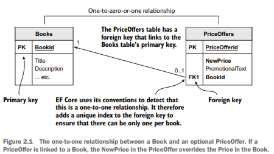
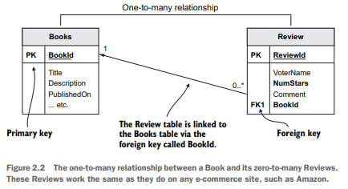
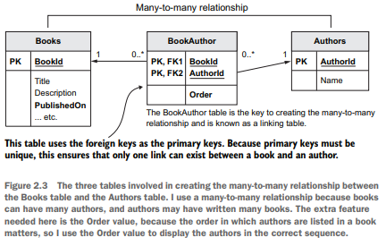

# Entity Framework Core in Action

## DB relationship types
1. One to one or zero to one relationship

    
2. One to many relationship

    
3. Many to many relationship

    
## Principal and dependent relationships
- Principal entity - contains a primary key that the dependent relationship refer to via a foreign key
- Dependent entity - contains the foreign key that refers to the principal entity's primary key

## Db referential integrity
- You can tell the database server to delete the dependent entities that rely on the principal entity, known as <b>cascade deletes</b>
- - You can tell teh database server to set the foreign keys of the dependent entities to null, if the column allows that
- I neither of those rules is set up, the database server will raise an error if you ry to delete a principal entity with dependent entities
